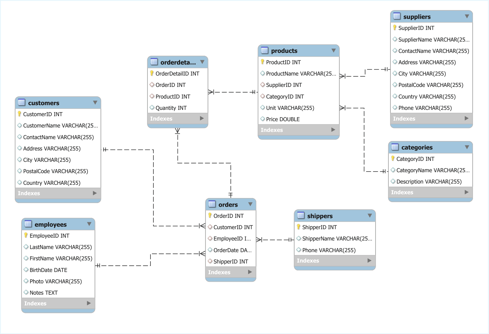

# 📋 Project Overview

This repository contains a comprehensive set of SQL reporting queries built on the W3Schools sample database. 
These queries demonstrate real-world business reporting scenarios including sales analysis, employee performance tracking, inventory management, and customer insights.

The assignment for day 5 is a capstone-style lab includes answering realistic business-style questions using relational data.
Joins, filtering, aggregation, window functions, conditional logic, common table expressions, and subqueries are used to produce clear, accurate SQL reports.

### Reports were created for the following business questions:
- Total Sales per Product Category
- Monthly Sales Trends
- Top 5 Customers by Total Spending in Q4 1996
- Employee Performance Ranking Report
- Top 10 Best-Selling Products

## 🗂️ Database Schema

### Entity–Relationship Diagram


The W3Schools database includes the following key tables:

```
Customers - Customer information
Employees - Employee details
Orders - Order transactions
OrderDetails - Line items for each order
Products - Product catalog
Categories - Product categories
Suppliers - Supplier information
Shippers - Shipping companies
```

The database and instructions to install can be found here:
https://github.com/uwla/sample_mysql_database